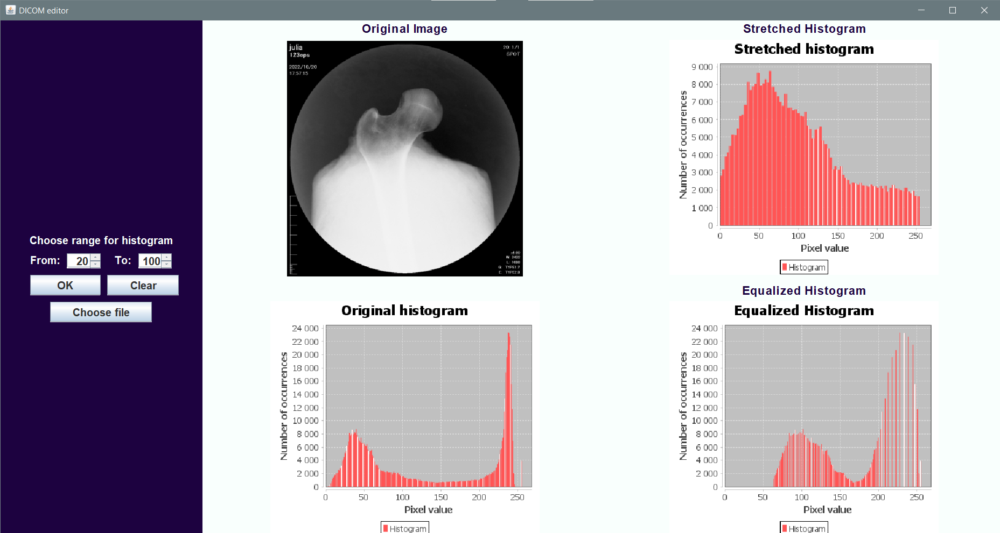

# DICOM App

An application allowing for the display of a DICOM image along with its histogram 
and its modification: stretching and equalization.  

## Table of Contents
* [External_libraries_used](#external-libraries-used)
* [Functionalities](#functionalities)
* [Setup](#setup)
* [How it works](#how-it-works)
* [Project Authors](#project-authors)

## External libraries used
Required external libraries are located in the project's <b>libraries</b> folder.   
jcommon-1.0.23.jar  
jfreechart-1.0.19.jar  
pixelmed.jar  
pixelmed_imageio.jar

## Functionalities
- Displaying DICOM image
- Generating image histogram
- Histogram modification by stretching it to the range specified by the user
- Histogram modification using histogram equalization function

## Setup
It is required to have Java programming language installed on your computer and an appropriate 
compiler to handle this language.  
To run the application correctly, it is necessary to have the required [libraries](#external-libraries-used) installed.
They are located in the project folder <b>libraries</b>.  
How to add external libraries to the project path on Intelij IDEA:  
Right click on the project > Open module setting > Modules > Add(+) > select .JAR files from the folder
<b>libraries</b>.  
The application is launched from the file `MyMainFrame.java`.

## How it works
You can load chosen DICOM file (example images are in the folder <b>dicomy</b>). It will display an image, as well as 
its original and equalized histogram. To display the stretched histogram, choose the range of pixels you want to stretch
it and click OK button.

## Project Authors
**Julia Rozmarynowska**

- handling Dicom files, extracting file information
- generating and modifying histograms
- documentation
 

**Julia Walczyna**

- designing the GUI layer of the application
- implementing functions in the main application window 
- documentation
- README.md file
